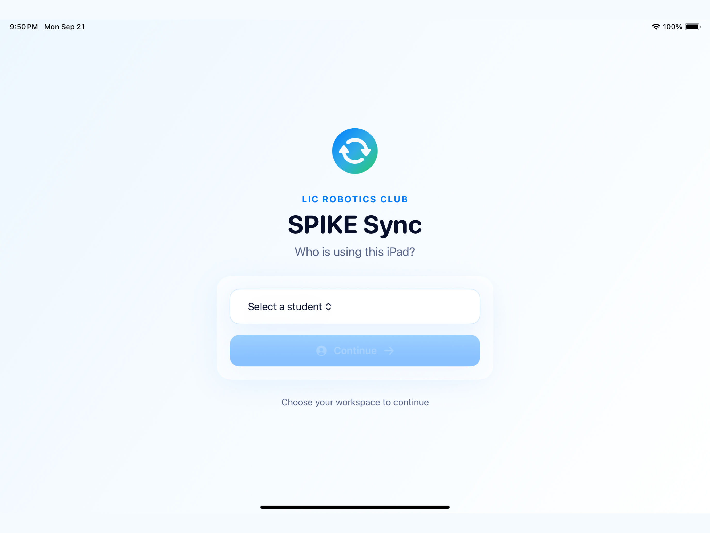
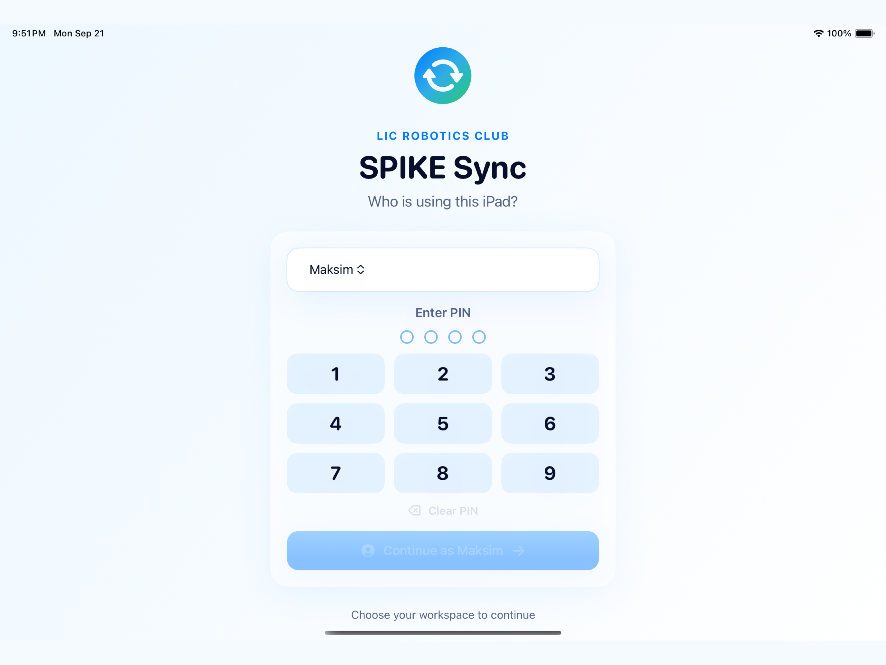
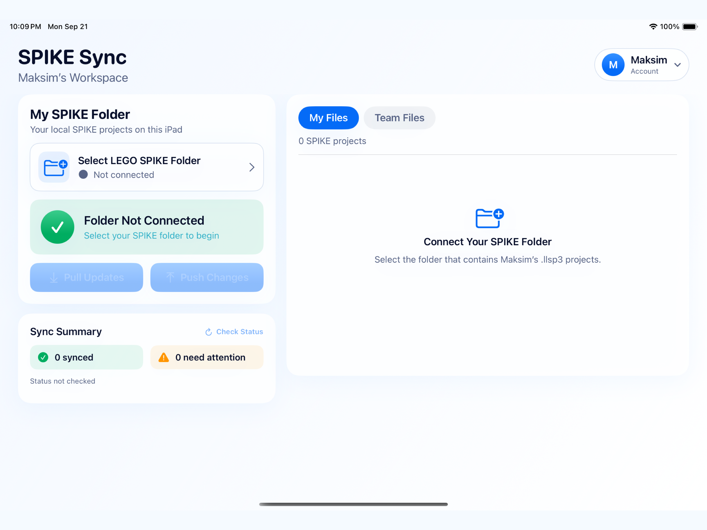

# LIC Robotics Sync

LIC Robotics Sync is an iPad app for sharing and backing up LEGO® Education SPIKE™ project files within the LIC Robotics Club.

Each student works in a separate folder in this repository. The app lets students synchronize their own projects, see projects shared by teammates, and copy a teammate's project into their own workspace.

> This is a club project and is not affiliated with or endorsed by the LEGO Group.

## Sign in

Select your name and enter the four-digit PIN.

### Student PIN Codes

| Student | PIN |
| :------ | :-- |
| Sven | `4827` |
| Maksim | `6159` |
| Kaiki | `3748` |
| Greyson | `8264` |
| Leo | `5391` |
| Brandon | `2476` |





Your selected student determines which repository folder the app uses. For example, Maksim works with `students/maksim/`.

## Connect your SPIKE folder

After signing in:

1. Tap **Select LEGO SPIKE Folder**.
2. Choose the folder in Files where you keep exported `.llsp3` projects.
3. Allow the app to access that folder.

The app remembers the selected folder. If access is lost after reinstalling the app or moving the folder, select it again.



## Pull Updates and Push Changes

Synchronization is deliberately manual. The app does not continuously send requests in the background.

### Pull Updates

Tap **Pull Updates** to download the latest files from your student folder on GitHub to the selected folder on the iPad.

Use this before starting work when another device may have uploaded newer versions.

### Push Changes

Tap **Push Changes** to upload your current local projects to your student folder on GitHub.

Files deleted locally through LIC Robotics Sync are also removed from GitHub on the next push. Always check the list before pushing.

### Check Status

Tap **Check Status** to rescan the local folder and compare it with GitHub without downloading or uploading anything.

Typical statuses include:

- **Synced** — the local and GitHub versions match.
- **Not backed up** — the local file has not been uploaded yet.
- **Needs attention** — the local and remote versions differ.
- **Removed from iPad** — a previously synchronized file was deleted locally and will be removed from GitHub after the next push.

## Save a project from SPIKE

To save the project currently open in the LEGO SPIKE app:

1. Open the project in **LEGO SPIKE**.
2. Open the project menu (`⋮`).
3. Choose **Share Project**.
4. Select **Save to SPIKE Sync** in the iPad share sheet.
5. Return to LIC Robotics Sync and tap **Check Status**.
6. Tap **Push Changes** when you are ready to upload it.

The **Save to SPIKE Sync** action is installed automatically with the main app.

## Use a teammate's project

1. Open the **Team Files** tab.
2. Select a teammate.
3. Find the project you need.
4. Tap **Copy to My Projects**.
5. Confirm replacement if a local project with the same filename already exists.

Copying creates your own local copy. It does not modify the teammate's original project.

## Delete a project

1. In **My Files**, tap the delete button next to the project.
2. Confirm the deletion.
3. Tap **Push Changes** to remove the corresponding GitHub copy.

Deleting a project through the sync app does not directly delete LEGO SPIKE's internal cached entry. If SPIKE still displays a deleted project that cannot be opened, remove that entry from inside the SPIKE app.

## Repository structure

```text
students/
├── brandon/
├── greyson/
├── kaiki/
├── leo/
├── maksim/
└── sven/
```

Each student should work only in their own folder. The repository is public, so do not store passwords, personal information, or private documents here.

## Troubleshooting

### A project is missing from My Files

- Tap **Check Status**.
- Confirm that the correct SPIKE folder is connected.
- Export the latest project again using **Share Project → Save to SPIKE Sync**.

### A project does not appear in LEGO SPIKE

The SPIKE app may not automatically index files placed in another app's folder. Open or import the `.llsp3` file from Files, or use the iPad share sheet to open it in LEGO SPIKE.

### Pull or Push fails

- Confirm that the iPad is connected to the internet.
- Tap **Check Status** and retry.
- Do not rename or move the selected folder while the app is open.
- If the problem continues, take a screenshot of the error and send it to the coach.

## For coaches

- Student project data is stored in `students/<student-name>/`.
- Distribute student PINs privately.
- Review project changes on GitHub before restoring or deleting files manually.
